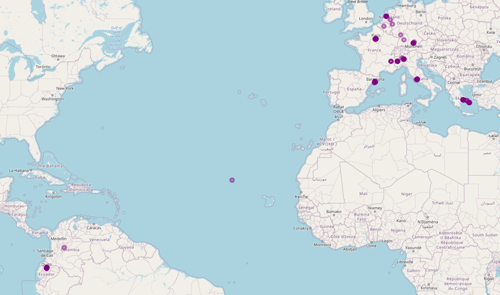
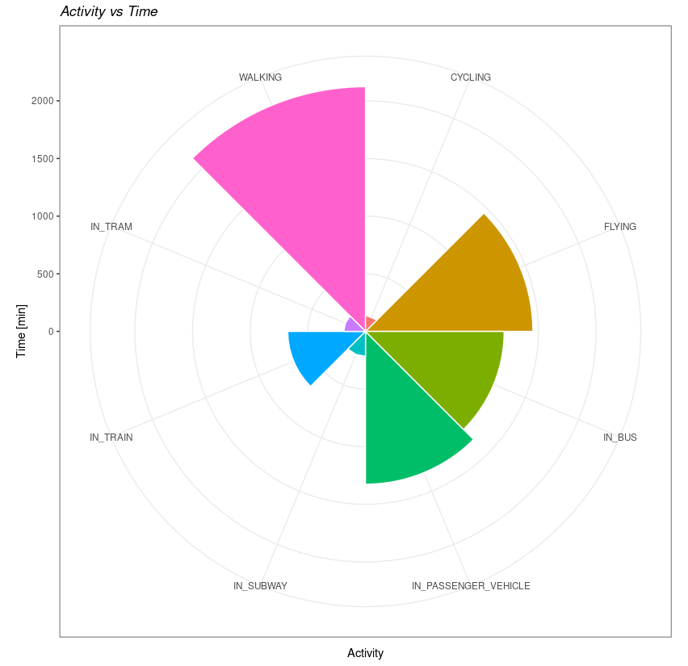
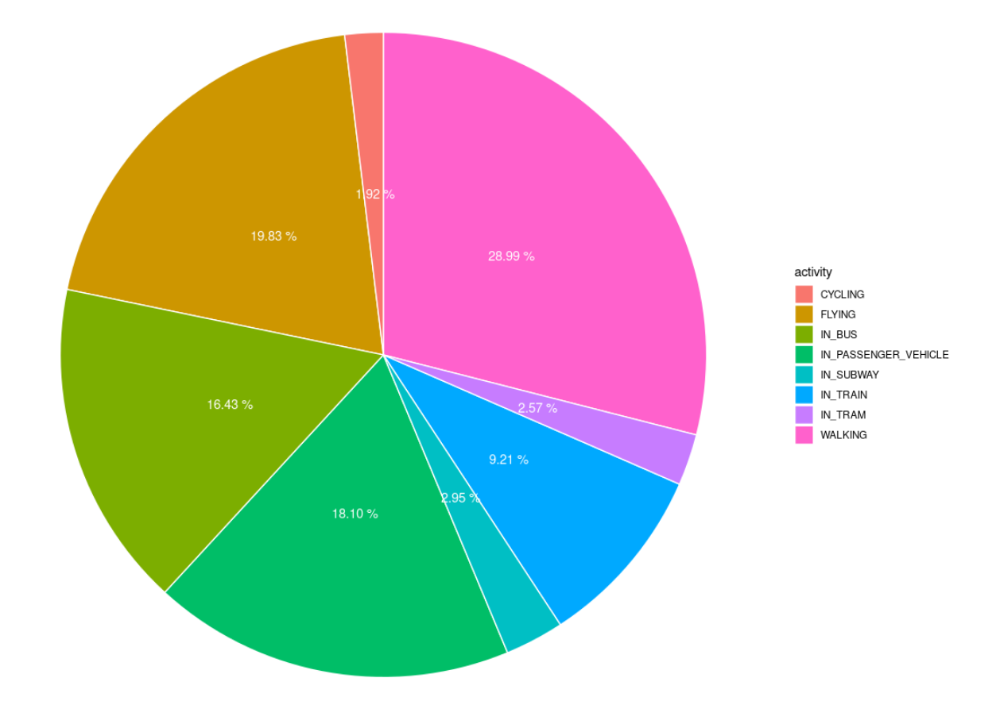
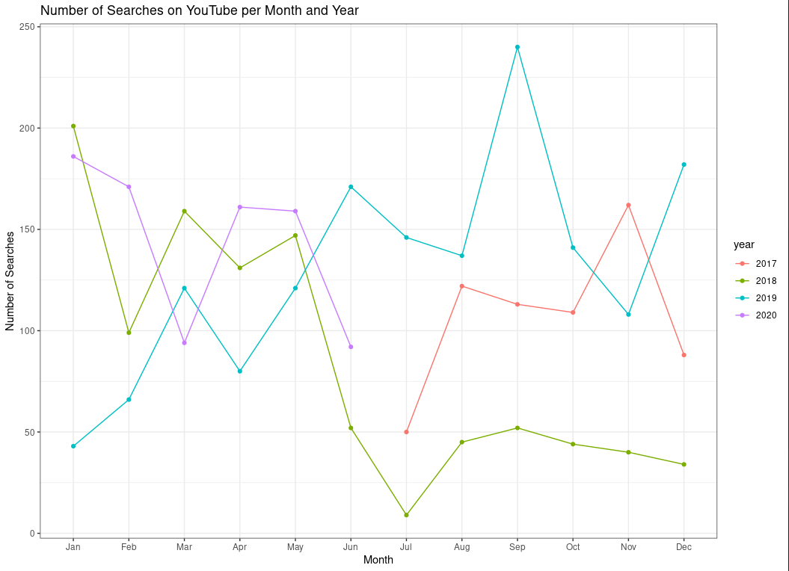
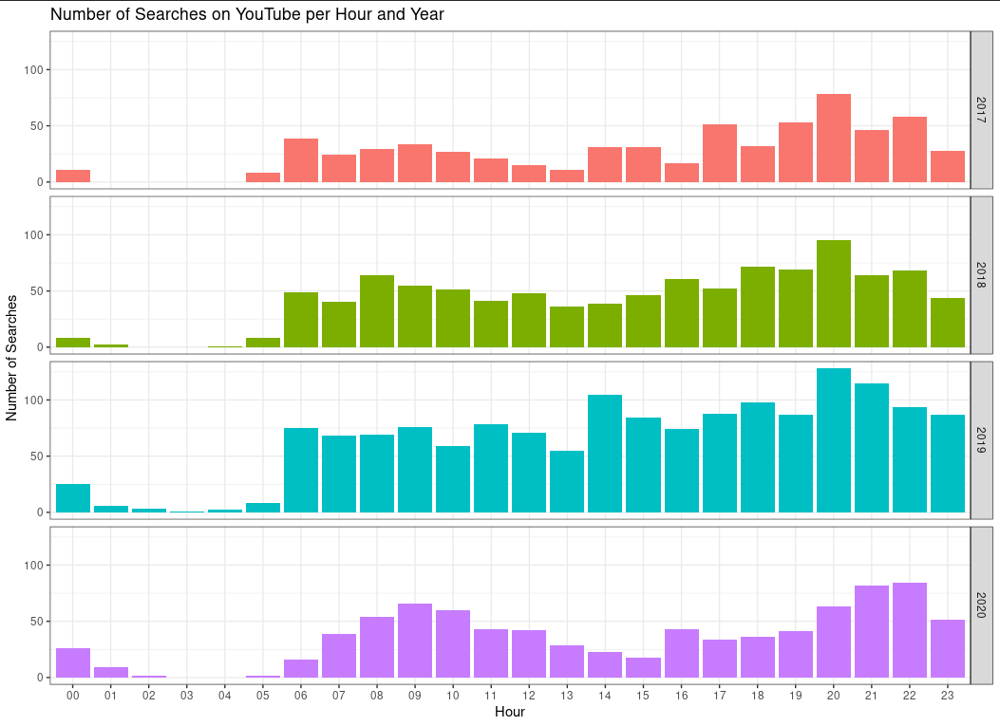

# Personal Google Data Analysis (Google Takeout)

This repository contains files that allow you to analyze data obtained from Google Takeout.

## Parsing the json file

The script "data_parsing.py" allows to extract activity and visited sites data from the JSON file. Additionally, a data frame is created with this data, this data frame is exported to a csv file in order to analyze the data with R.

## Analyzing the data

The script "data analysis.R" allows us to filter the data in order to obtain information of interest. Later, we proceed to make some graphics to understand the data.

## My Locations in the map
The following image shows the places in the world where Google has detected my location. Also, by positioning the cursor at a specific point you can see the name of the place where I have been.

By resizing the map you can see the points in a better way.

## My activities

In the following image you can see all the activities I did in a period of time. The graph illustrates the time (minutes) invested in each activity and also the proportion.

 

The next graph illustrates the proportion and the percentage of each activity I have done.

## YouTube analysis

In the following image the most used words in the YouTube search engine are analyzed and a word cloud is made. To parsing the html document the script "youtube.py" is used, additionally the script "youtube_analysis.R" is used to count the words in the dataframe and make the graph.

For the following graphics we use the dataframe with the name "sentences.csv" and the script "youtube_analysis.R". The data is analyzed and summarized by month, year and time of the searches.

